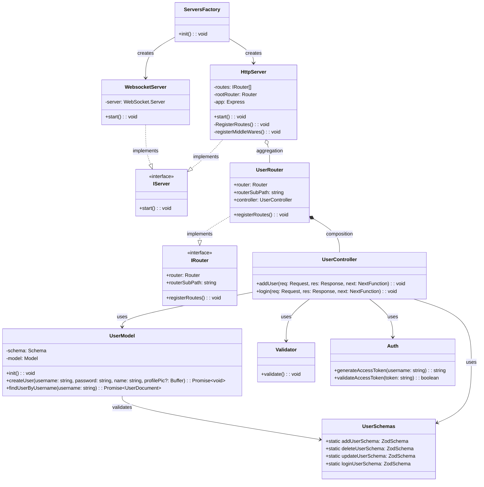

## Architecture Overview
Architecture Overview
The development of a route for an entity, exemplified by the User entity, follows a structured process of Separation of Concerns and modular architecture. This approach forms a blueprint for the implementation of other entities within the system:

1. Define the Interface (IRouter)
2. Implement the specific Router (UserRouter)
3. Develop the Controller (UserController)
4. Create validation schemas (UserSchemas)
5. Implement the Data Model (UserModel)

### 1. Router Layer (IRouter / UserRouter)
- The `IRouter` interface defines a contract for all router classes
- `UserRouter` implements this interface for user-specific routes
- Responsible for registering endpoints and forwarding to the corresponding controller

### 2. Controller Layer (UserController)
- Central logic for user actions
- Orchestrates processes like adding users and logging in
- Coordinates interactions between:
  - Validator (input validation)
  - UserModel (database operations)
  - Auth (token generation)

### 3. Validation (UserSchemas / Validator)
- Uses Zod for schema validation
- Defines strict rules for:
  - User registration
  - User updates
  - Login process
- Ensures data consistency and integrity

### 4. Data Model (UserModel)
- Mongoose-based database interaction
- Methods for:
  - Creating users
  - Searching for users
- Implements the database schema
- Encrypts sensitive data such as passwords

### 5. Authentication (Auth)
- Token-based authentication
- Generates and validates access tokens
- Secures application endpoints

### 6. Server Infrastructure

#### 6.1 Server Interfaces and Implementations

##### IServer Interface
- Defines a contract for different server types
- Standard method `start()` for server initialization
- Enables flexible and extensible server implementations
##### HttpServer
- Manages HTTP routes and middleware
- Dynamically registers all routes through `IRouter` implementations
- Configures Express middleware:
  - JSON parsing
  - Security headers (Helmet)
  - Centralized error handler

##### WebsocketServer
- Handles WebSocket connections
- Enables real-time communication
- Currently basic connection handling

##### ServersFactory
- Central initialization component
- Responsible for:
  - Database initialization
  - Creating and starting various servers
  - Configuring the overall server setup

#### Middleware and Security
- Helmet for additional HTTP security headers
- Centralized error handler
- JSON parsing for incoming requests

### Architecture Benefits
- Modularity through interfaces
- Separation of concerns
- Easy expandability
- Flexible routing
- Integrated security mechanisms
